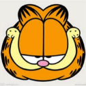

# 裁剪不规则图像

有时候需要裁剪出一张不规则形状的图片，比如说一张脸：

[嘻哈人物图片一张]

这次活动里就有这么一需求，为了效果自然希望能贴着脸的轮廓裁剪。

...

...

其实通过一个canvas渲染环境的属性就可以实现。

## api

当我们在canvas上已经绘有一部分图案，再往上面覆盖新图案时，一般就是两张图片叠在一起的效果：上面把下面给盖住。但其实canvas给我们提供了多种选择：

- CanvasRenderingContext2D.[globalCompositeOperation](https://developer.mozilla.org/en-US/docs/Web/API/CanvasRenderingContext2D/globalCompositeOperation):  设定在画新图形时采用的覆盖策略。

    一共有12种取值，这里用到的是`source-in`:
    
        新图形只在新图形和目标画布重叠的地方绘制。其他的都是透明的。

- 使用方法：
    ```js
        ctx.globalCompositeOperation = "source-in"; 
    ```

## 示例


- 用一张人脸轮廓做底图  (face):

    

- 覆盖加菲猫头像 (cat):

    

- 结果底图上透明的地方都被裁掉了，只有内容重叠的地方留下 (效果):

    


代码大致如下:

```js
    var canvas = document.getElementById('canvas');
    var ctx = canvas.getContext("2d");

    // 绘制脸部底图
    ctx.drawImage(face, 0, 0, 126, 126);
    // 切换合成操作
    ctx.globalCompositeOperation = "source-in";
    // 绘制头像
    ctx.drawImage(cat, 0, 0, 126, 126);
```

注意图像`绘制顺序`和`覆盖策略`调整。先给绘一些内容做底图，然后才调整策略、覆盖上新内容。

**[示例Demo及完整代码](...)**

**[活动Demo](...)**


## 兼容性

这里用到的只是CanvasRenderingContext2D的一个属性，兼容性表上只能查到canvas的数据。不过许多低版本的设备也支持canvas，经测试 Android 5.0 和 iOS 8 上都表现正常。
